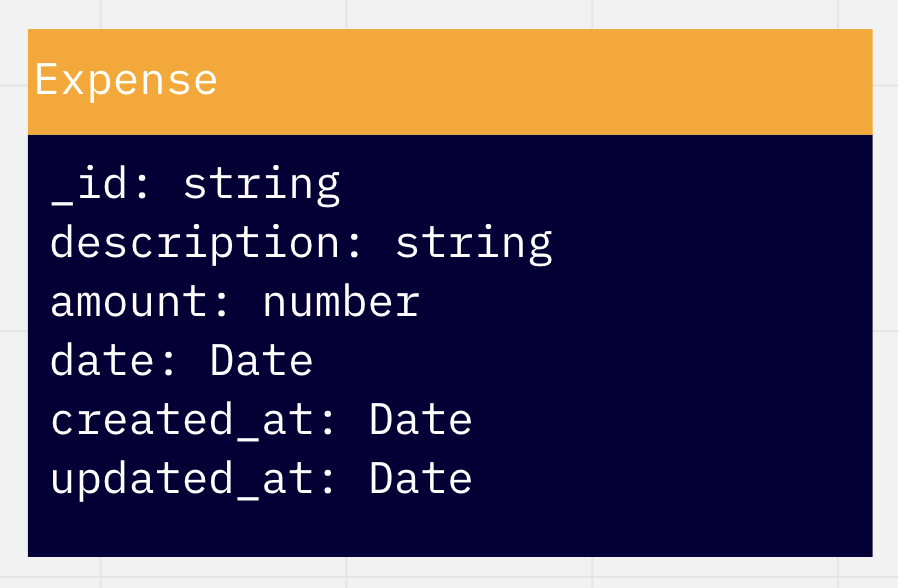

# Dynaboot

[](https://www.npmjs.com/package/example-typescript-react-component-library) [](https://www.npmjs.com/package/example-typescript-react-component-library)

Dynaboot application which is dynamicly backend challenge built with [TypeScript](https://github.com/Microsoft/TypeScript) and [Nodejs](https://nodejs.org/en/)

## Project structure

The project contains a `src` directory which is where majority of our application resides with an entry point `server.ts` at the root directory of our project
<br />

| Folder        | Description                                                     |
| :------------ | :-------------------------------------------------------------- |
| config        | Global application variables stored here or retrieved fron .env |
| dao           | Date layer of application that accesses DB                      |
| domain-models | Domain Models for application                                   |
| models        | Database base Model for Expesnse Model                          |
| routes        | Application Routing                                             |
| services      | Service Layer of application                                    |

## Setup

```sh
# Install apllication dependencies
npm install

```

## Development

```sh
# Run Locally
npm run start:build && npm run start:run

```

## Testing

```sh
# Run integration test for application
npm run test
```

## Entity Relationship Diagram


